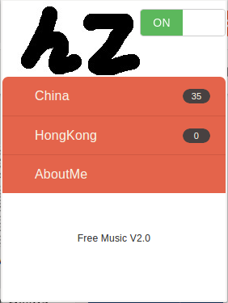
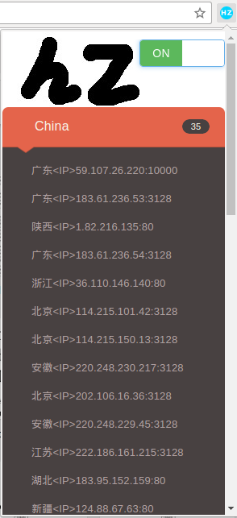

## Free Music

The chrome extension plugin helps users who used to listen to music on Chinese websites(e.g. music.163.com, xiami.com) but far away from china.
You can install this plugin through Chrome Web Store:
https://chrome.google.com/webstore/detail/free-music/dbojijjchkbbdjmeplgikimjoikjnhlo

## UI

## License

The source code is released under [GPL v3](http://www.gnu.org/licenses/gpl-3.0.html)
